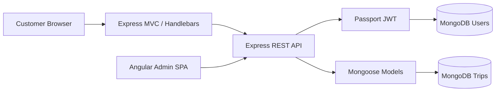

# Travlr Getaways — Full-Stack MEAN Application

[](https://github.com/Vet-Hub24/CS465-FullStack/actions/workflows/ci.yml)

Travlr Getaways is my **CS 465 Full Stack Development** portfolio project at Southern New Hampshire University. It connects a public Express website, a REST API, MongoDB, and an Angular administrator SPA into one application with authenticated trip management.

> **Portfolio note:** This repository is a cleaned and documented portfolio version of the academic project. Course starter assets/framework code were provided as part of the class; the repository highlights the application integration, API/database work, Angular administration features, authentication, testing, and troubleshooting completed during the course.

## What the application demonstrates

- **Express MVC customer site** with server-rendered Handlebars views
- **REST API** for trip and authentication operations
- **MongoDB + Mongoose** persistence and schemas
- **Angular 17 administrator SPA** using standalone components and services
- **JWT authentication** with Passport middleware for protected operations
- **CRUD trip management** for authenticated administrators
- **PBKDF2 password hashing** with per-user salts
- **Input validation, duplicate handling, and clear HTTP status codes**
- **GitHub Actions CI** that checks server JavaScript and builds the Angular application

## Architecture



The public site retrieves trip data through the same REST API used by the Angular administration client. Administrative POST, PUT, and DELETE requests require a valid Bearer token.

## API

| Method | Endpoint | Purpose | Access |
| --- | --- | --- | --- |
| `POST` | `/api/register` | Register an administrator | Public |
| `POST` | `/api/login` | Authenticate and receive JWT | Public |
| `GET` | `/api/trips` | Retrieve all trips | Public |
| `GET` | `/api/trips/:tripCode` | Retrieve one trip | Public |
| `POST` | `/api/trips` | Add a trip | JWT required |
| `PUT` | `/api/trips/:tripCode` | Update a trip | JWT required |
| `DELETE` | `/api/trips/:tripCode` | Delete a trip | JWT required |

## Project structure

```text
app_server/          Express MVC routes, controllers, Handlebars views
app_api/             REST API, Mongoose models, Passport/JWT authentication
app_admin/           Angular 17 administrator SPA
public/              Customer-site styling
data/                MongoDB seed data
scripts/             Local source validation helper
.github/workflows/   Continuous-integration workflow
app.js               Express application configuration
bin/www              HTTP server entry point
```

## Run locally

### Requirements

- Node.js 18+
- npm
- MongoDB running locally

### 1. Install server dependencies

```bash
npm install
```

### 2. Configure the JWT secret

Copy the values in `.env.example` into your shell/environment. The application intentionally does **not** contain a hard-coded JWT secret.

PowerShell example:

```powershell
$env:JWT_SECRET="replace-with-a-long-random-secret"
$env:DB_HOST="127.0.0.1"
$env:ADMIN_ORIGIN="http://localhost:4200"
```

### 3. Seed MongoDB and start Express

```bash
npm run seed
npm start
```

The customer site and API run at `http://localhost:3000`.

### 4. Start the Angular admin SPA

In a second terminal:

```bash
npm install --prefix app_admin
npm start --prefix app_admin
```

The admin SPA runs at `http://localhost:4200`.

## Validation

```bash
npm run check
npm run build:admin
```

The GitHub Actions workflow performs these checks automatically on pushes and pull requests.

## Testing performed during the course

The project was exercised through the browser and Postman, including administrator registration/login, public GET requests, authenticated POST/PUT/DELETE requests, failed requests without a valid Bearer token, Angular route protection, and database-backed trip changes.

## Skills practiced

JavaScript · Node.js · Express · REST APIs · JSON · MongoDB · Mongoose · Angular · TypeScript · Handlebars · JWT · Passport · CRUD · Postman · Git/GitHub
